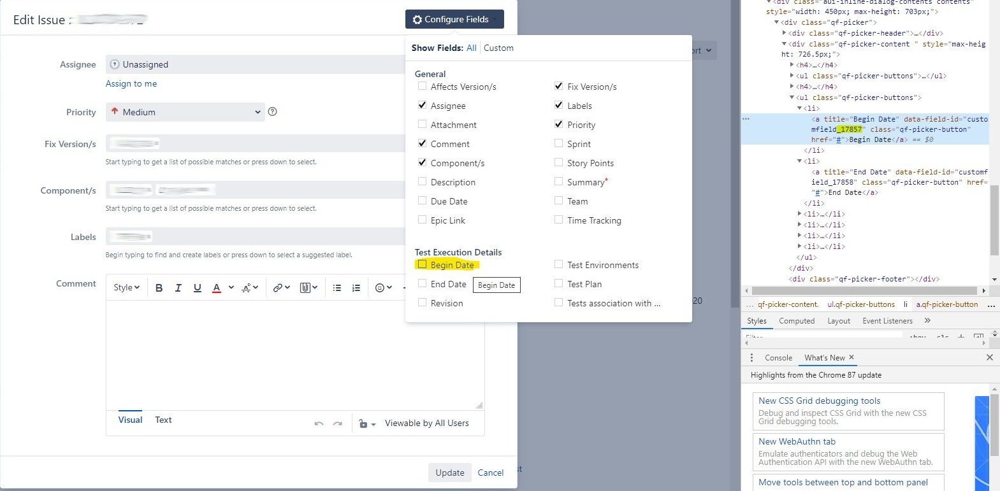

# Testerra Xray Connector

<p align="center">
    <a href="https://mvnrepository.com/artifact/io.testerra/xray-connector" title="MavenCentral"></a>
    <a href="/../../commits/" title="Last Commit"></a>
    <a href="/../../issues" title="Open Issues"></a>
    <a href="./LICENSE" title="License"></a>
</p>

<p align="center">
  <a href="#setup">Setup</a> •
  <a href="#documentation">Documentation</a> •
  <a href="#support-and-feedback">Support</a> •
  <a href="#how-to-contribute">Contribute</a> •
  <a href="#contributors">Contributors</a> •
  <a href="#licensing">Licensing</a>
</p>

## About this module

This module provides additional features for [Testerra Framework](https://github.com/telekom/testerra) for automated tests.

This module allows to synchronize the test results to the test management plugin Xray for Atlassian Jira.

## Setup

### Requirements

| Xray connector | Testerra         |
| -------------- | ---------------- |
| `1.0`          | ` 1.0.0 - 1.3`   |
| `1.1`          | ` 1.4..1.7`        |
| `1.2`          | ` 1.8`        |
| `1.3`          | ` 1.9`        |


### Usage

Include the following dependency in your project. Please replace the versions with the latest version.

Gradle:

````groovy
implementation 'io.testerra:xray-connector:1.2'
// From Testerra framework
implementation 'io.testerra:surefire-connector:1.8'
````

Maven:

````xml

<dependency>
    <groupId>io.testerra</groupId>
    <artifactId>xray-connector</artifactId>
    <version>1.2</version>
</dependency>
<!-- From Testerra framework -->
<dependency>
    <groupId>io.testerra</groupId>
    <artifactId>surefire-connector</artifactId>
    <version>1.8</version>
</dependency>
````

## Documentation

### Add property file

To use the Xray Connector plugin you have to provide multiple properties in your test project.  
The easiest way is to create a file `xray.properties` in `src/test/resources` directory of your project.

````properties
# Enable synchronization and define strategy
xray.sync.enabled=true
xray.sync.skipped=true
xray.sync.strategy=adhoc

# Connection details (mandatory)
xray.rest.service.uri=https://jira.example.com/rest
xray.project.key=PROJECT-KEY

# Xray connector supports Token based authentication or basic authentication
# If no token is defined, Xray connector uses 'user/password'
xray.token=jiratoken
# or
xray.user=jira-sync-user
xray.password=password


# Jira field IDs (mandatory)
xray.test.execution.start.time.field.id=
xray.test.execution.finish.time.field.id=
xray.test.execution.revision.field.id=
xray.test.execution.test-environments.field.id=
xray.test.execution.test-plan.field.id=

# Validations to avoid unintended operations
xray.validation.revision.regexp=.*
xray.validation.summary.regexp=.*
xray.validation.description.regexp=.*

# Automatically transitions when state reached
xray.transitions.on.created=
xray.transitions.on.updated=Test beginnen,Testdurchführung beenden,Testdurchführung zurücksetzen
xray.transitions.on.done=An Test übergeben

# Store previous results, when Updated test Execution is used
xray.previous.result.filename=

# Debugging features
xray.webresource.filter.getrequestsonly.enabled=false
xray.webresource.filter.getrequestsonly.fake.response.key=EXAMPLE-1
````

With this property file included and filled up with your user account and credentials you should be able to synchronize your test
results with the adhoc-strategy.

### Retrieve custom field IDs

The Jira Xray fields are implemented as custom fields and they may differ with every Jira installation. Thats why you must setup
them.

You can retrieve these IDs directly from the Jira frontend by inspecting the field in the DOM as shown in the following screenshot.



### Synchronization strategies

#### Adhoc

When property `xray.sync.strategy` is set to `adhoc` your test results will be synchronized directly after a test method finished.  
This will ensure, that you can track the current progress of your test execution in real-time in Jira.

Please note that uploads and attachments for test execution will be uploaded after the execution finished.

#### Posthoc

When property `xray.sync.strategy` is set to `posthoc` your test results will be synchronized after the *complete* test execution
ends.  
The Xray connector will store every test result internally and then progress a bulk-upload of all test results.

### Implement interfaces

For full control at runtime the Xray connector provide interfaces, that you have to implement before getting started.  
This approach let you configure nearly everything that can be configured - at run time!

The easiest way is, to start with this example.  
This implementation will provide static `XrayTestExecutionInfo`, but in practice you should determine these values at runtime.

With this configuration, the Xray connector will lookup for a Jira issue with the following matching properties:

- Type: `Test Execution`
- Summary (title)
- Revision

If a test execution could be found, it will be reused and updated, otherwise a new one will be created.
If you provide `null` values, the connector will ignore these fields.

```java
public class XrayResultsSynchronizer extends AbstractXrayResultsSynchronizer {

    @Override
    public XrayTestExecutionInfo getExecutionInfo() {
        return new XrayTestExecutionInfo() {

            @Override
            public String getSummary() {
                return "My Test Execution";
            }

            @Override
            public String getDescription() {
                return "Automated test run";
            }

            @Override
            public String getRevision() {
                return "1.0-RC1";
            }

            @Override
            public String getAssignee() {
                return null;
            }

            @Override
            public String getFixVersion() {
                return null;
            }

            @Override
            public List<String> getTestEnvironments() {
                return null;
            }
        };
    }

//    @Override
//    public XrayMapper getXrayMapper() {
//        return null;
//    }

//    @Override
//    public XrayTestExecutionUpdates getExecutionUpdates() {
//        return null;
//    }
}
```

### Mapping

To synchronize your test results to a specific Jira issue, the Xray connector will use some mapping.  
Basically there are two ways of mapping, both of them are instructed and controlled by annotations.

#### Test method mapping

To create a one-to-one mapping between your test methods and your Jira issues of type `Test` you just have to set up the `XrayTest`
annotation on your method.

````java
public class MethodsAnnotatedTest extends TesterraTest {

    @Test
    @XrayTest(key = "EXAMPLE-2")
    public void passes() {
        Assert.assertTrue(true);
    }
}
````

#### Test class mapping

Instead of annotating each method by itself, you can annotate just the test class with the `XrayTestSet` annotation  
and the Xray connector will do the rest for you by searching Jira issues itself with the provided query on your implementation
of `XrayMapper.methodToXrayTestQuery`.

For example, you can provide the following simple mapper, that will just grab the test method name and search Jira issues by
matching summary.

````java

@XrayTestSet(key = "EXAMPLE-5")
public class AnnotatedClassTest extends TesterraTest {
    //...
}
````

````java
public class TestMethodNameMapper implements XrayMapper {

    @Override
    public JqlQuery resultToXrayTest(ITestResult testNgResult) {
        final Object[] parameters = testNgResult.getParameters();
        if (parameters.length > 0) {
            final String summary = String.format("%s with %s", testNgResult.getMethod().getMethodName(), parameters[0]);
            return JqlQuery.create()
                    .addCondition(new SummaryContainsExact(summary))
                    .build();
        } else {
            return JqlQuery.create()
                    .addCondition(new SummaryContainsExact(testNgResult.getMethod().getMethodName()))
                    .build();
        }
    }

    @Override
    public JqlQuery classToXrayTestSet(ITestClass testNgClass) {return null;}
}
````

> Note : The default `EmptyMapper` will return `null`. This will lead in a synchronization error, because no matching Jira issue was found.

#### Generic mapping

If you don't want to annotate your class with `XrayTestSet` and neither your test methods with `XrayTest` you can use a full generic
way by implementing the `XrayMapper.classToXrayTestSet()` method as well as the already known `methodToXrayTestQuery()`.

````java
public class GenericMapper implements XrayMapper {

    @Override
    public JqlQuery resultToXrayTest(ITestResult testNgResult) {
        final Object[] parameters = testNgResult.getParameters();
        if (parameters.length > 0) {
            final String summary = String.format("%s with %s", testNgResult.getMethod().getMethodName(), parameters[0]);
            return JqlQuery.create()
                    .addCondition(new SummaryContainsExact(summary))
                    .build();
        } else {
            return JqlQuery.create()
                    .addCondition(new SummaryContainsExact(testNgResult.getMethod().getMethodName()))
                    .build();

        }
    }

    @Override
    public JqlQuery classToXrayTestSet(ITestClass testNgClass) {
        return JqlQuery.create()
                .addCondition(new SummaryContainsExact("My Tests"))
                .build();
    }
}
````

In this case the Xray connector will search Jira issues for an issue of type `TestSet` with matching summary `My Tests`.  
Then the connector will run a search for all associated test methods for this test set to find an issue of type `Test` and a summary
equal the test method name.

### Test execution updates on transition

As you may noticed in the cod examples above we provided a `EmptyTestExecutionUpdates` as implementation
for `XrayTestExecutionUpdates` in our `FooXrayResultsSynchronizer`.  
Test execution updates should be defined to add metadata to associated Jira issue of type `Test Execution`.

The Xray connector will lookup Jira for Test execution matching your criteria provided as `XrayTestExecutionInfo`.  
But if no matching Test Execution was found, it will create a new one by using the Jira API.

To add labels, revision, summary, fix versions, associated version or other execution info you can use your own implementation
of `XrayTestExecutionUpdates`.

````java
public class DefaultTestExecutionUpdates implements XrayTestExecutionUpdates {

    @Override
    public JiraIssueUpdate updateOnNewExecutionCreated() {
        return JiraIssueUpdate.create()
                .field(new SetLabels("TestAutomation"))
                .field(new TestPlan("TICKET-ID"))
                .build();
    }

    @Override
    public JiraIssueUpdate updateOnExistingExecutionUpdated() {
        return JiraIssueUpdate.create()
                .field(new SetLabels("TestAutomation"))
                .build();
    }

    @Override
    public JiraIssueUpdate updateOnExecutionDone() {
        return JiraIssueUpdate.create()
                .field(new SetAffectedVersions("1.0-RC"))
                .build();
    }
}
````

For example, this simple implementation will add the label "Test Automation" to your "updated" or freshly created test execution and
set the "affected version" to "1.0-RC".

### Properties

|Property|Default|Description|
|---|---|---|
|xray.sync.enabled|false|Enable synchronization|
|xray.sync.skipped|false|Enable synchronization of test methods in state SKIPPED|
|xray.sync.strategy|adhoc|Enable `adhoc` or `posthoc` synchronization|
|xray.rest.service.uri|not set|URI of the Jira REST service (with Xray-Plugin installed)|
|xray.project.key|not set|Jira project key|
|xray.user|not set|Jira user to sync test execution|
|xray.password|not set|Associated password for user|
|xray.test.execution.start.time.field.id|not set|The Jira custom field for test execution start time.|
|xray.test.execution.finish.time.field.id|not set|The Jira custom field for test execution finish time.|
|xray.test.execution.revision.field.id|not set|The Jira custom field for test execution revision.|
|xray.test.execution.test-environments.field.id|not set|The Jira custom field for test execution test-environments.|
|xray.test.execution.test-plan.field.id|not set|The Jira custom field for test execution test-plans.|
|xray.validation.revision.regexp|.*|Revision is validated against this regular expression to prevent unintended creation of test executions.|
|xray.validation.revision.summary|.*|Summary is validated against this regular expression to prevent unintended creation of test executions.|
|xray.validation.revision.description|.*|Description is validated against this regular expression to prevent unintended creation of test executions.|
|xray.previous.result.filename|not set|When updating test execution, previous results are attached as json files using the defined file name. Default: No file created.|
|xray.transitions.on.created|not set|Transitions made on Jira issue of type "Test Execution" when a status 'created' is reached (comma separated)|
|xray.transitions.on.updated|not set|Transitions made on Jira issue of type "Test Execution" when a status 'updated' is reached (comma separated)|
|xray.transitions.on.done|not set|Transitions made on Jira issue of type "Test Execution" when a status 'done' is reached (comma separated)|
|xray.webresource.filter.logging.enabled|false|Enable logging of all web requests and response sent/received to/from Jira (deprecated)|
|xray.webresource.filter.getrequestsonly.enabled|false|Enable this for debugging to avoid PUT/POST/DELETE requests sent to Jira|
|xray.webresource.filter.getrequestsonly.fake.response.key|FAKE-666666|This key will returned, when `xray.webresource.filter.getrequestsonly.enabled` set to `true` and PUT/POST/DELETE request was sent.|

---

## Publication

This module is deployed and published to Maven Central. All JAR files are signed via Gradle signing plugin.

The following properties have to be set via command line or ``~/.gradle/gradle.properties``

| Property                      | Description                                         |
| ----------------------------- | --------------------------------------------------- |
| `moduleVersion`               | Version of deployed module, default is `1-SNAPSHOT` |
| `deployUrl`                   | Maven repository URL                                |
| `deployUsername`              | Maven repository username                           |
| `deployPassword`              | Maven repository password                           |
| `signing.keyId`               | GPG private key ID (short form)                     |
| `signing.password`            | GPG private key password                            |
| `signing.secretKeyRingFile`   | Path to GPG private key                             |

If all properties are set, call the following to build, deploy and release this module:
````shell
gradle publish closeAndReleaseRepository
````

## Code of Conduct

This project has adopted the [Contributor Covenant](https://www.contributor-covenant.org/) in version 2.0 as our code of conduct. Please see the details in our [CODE_OF_CONDUCT.md](CODE_OF_CONDUCT.md). All contributors must abide by the code of conduct.

## Working Language

We decided to apply _English_ as the primary project language.  

Consequently, all content will be made available primarily in English. We also ask all interested people to use English as language to create issues, in their code (comments, documentation etc.) and when you send requests to us. The application itself and all end-user faing content will be made available in other languages as needed.

## Support and Feedback
The following channels are available for discussions, feedback, and support requests:

| Type                     | Channel                                                |
| ------------------------ | ------------------------------------------------------ |
| **Issues**   | <a href="/../../issues/new/choose" title="Issues"></a> |
| **Other Requests**    | <a href="mailto:testerra@t-systems-mms.com" title="Email us"></a>   |

## How to Contribute

Contribution and feedback is encouraged and always welcome. For more information about how to contribute, the project structure, as well as additional contribution information, see our [Contribution Guidelines](./CONTRIBUTING.md). By participating in this project, you agree to abide by its [Code of Conduct](./CODE_OF_CONDUCT.md) at all times.

## Contributors

At the same time our commitment to open source means that we are enabling -in fact encouraging- all interested parties to contribute and become part of its developer community.

## Licensing

Copyright (c) 2021 Deutsche Telekom AG.

Licensed under the **Apache License, Version 2.0** (the "License"); you may not use this file except in compliance with the License.

You may obtain a copy of the License at https://www.apache.org/licenses/LICENSE-2.0.

Unless required by applicable law or agreed to in writing, software distributed under the License is distributed on an "AS IS" BASIS, WITHOUT WARRANTIES OR CONDITIONS OF ANY KIND, either express or implied. See the [LICENSE](./LICENSE) for the specific language governing permissions and limitations under the License.
