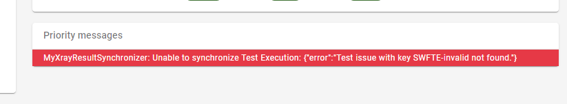

# Testerra Xray Connector

<p align="center">
    <a href="https://mvnrepository.com/artifact/io.testerra/xray-connector" title="MavenCentral"></a>
    <a href="/../../commits/" title="Last Commit"></a>
    <a href="/../../issues" title="Open Issues"></a>
    <a href="./LICENSE" title="License"></a>
</p>

<p align="center">
  <a href="#setup">Setup</a> •
  <a href="#documentation">Documentation</a> •
  <a href="#support-and-feedback">Support</a> •
  <a href="#how-to-contribute">Contribute</a> •
  <a href="#contributors">Contributors</a> •
  <a href="#licensing">Licensing</a>
</p>

## About this module

This module provides additional features for [Testerra Framework](https://github.com/telekom/testerra) for automated tests.

This module allows to synchronize the test results to the test management plugin Xray for Atlassian Jira.

## Setup

### Requirements

| Xray connector | Testerra       | Xray plugin |
|----------------|----------------|-------------|
| `1.0`          | `1.0.0..1.3`   | `>= 4.0.0`  |
| `1.1`          | `1.4..1.7`     | `>= 4.0.0`  |
| `1.2`          | `1.8`          | `>= 4.0.0`  |
| `1.3`          | `1.9..1.11`    | `>= 4.0.0`  |
| `1.4`          | `1.12`         | `>= 5.1.0`  |
 | `2.0-RC-5`     | `<= 2.0-RC-19` | `>= 4.0.0`  |
| `2.0-RC-6`     | `>= 2.0-RC-21` | `>= 5.1.0`  |
| `>=2.0`        | `>= 2.0`       | `>= 5.1.0`  |

From 2.3 you need at least __JDK11__.

### Usage

Include the following dependency in your project. Please replace the versions with the latest version.

Gradle:

```groovy
implementation 'io.testerra:xray-connector:2.3'
```

Maven:

```xml

<dependency>
    <groupId>io.testerra</groupId>
    <artifactId>xray-connector</artifactId>
    <version>2.3</version>
</dependency>
```

## Documentation

__Content__

* [Add property file](#add-property-file)
* [Implement synchronizer interface](#implement-synchronizer-interface)
* [How tests are sync](#how-tests-are-sync)
  * [Test Execution](#test-execution)
* [Mapping variants](#mapping-variants)
  * [Annotated Test](#annotated-test)
  * [DefaultSummaryMapper](#defaultsummarymapper)
  * [Custom mapping](#custom-mapping)
    * [Creating new entities](#creating-new-entities)
    * [Updating existing entities](#updating-existing-entities)
    * [Perform transitions of issues](#perform-transitions-of-issues)
  * [How to use JqlQuery](#how-to-use-jqlquery)
* [Jira custom fields IDs](#jira-custom-fields-ids)
* [Properties](#properties)
  
Steps to use the Xray Connector plugin:
1. [Define properties](#add-property-file) 
2. [Implement synchronizer](#implement-synchronizer-interface)
3. [Define the issue mapping and the annotations](#how-tests-are-sync)

### Add property file

To use the Xray Connector plugin you have to provide multiple properties in your test project.  
The easiest way is to create a file `xray.properties` in `src/test/resources` directory of your project.

```properties
# Enable synchronization and define strategy
xray.sync.enabled=true

# Connection details (mandatory)
xray.rest.service.uri=https://jira.example.com/rest
xray.project.key=PROJECT-KEY

# Xray connector supports Token based authentication or basic authentication
# If no token is defined, Xray connector uses 'user/password'
xray.token=jiratoken
# or
xray.user=jira-sync-user
xray.password=password
```

Important: You also need to configure [Jira custom fields IDs](#jira-custom-fields-ids)!

### Implement synchronizer interface

Before synchronisation can take place, you need to create a subclass of `AbstractXrayResultsSynchronizer`, which implements the interface `XrayResultsSynchronizer`.

The Xray connector will look up in the class path for your implementation and initialize it.

```java
// This is the simpliest implemented result synchronizer 
public class MyXrayResultsSynchronizer extends AbstractXrayResultsSynchronizer {
}
```

### How tests are sync

The common way of sync the results to Jira Xray is working like as follows:

`Execute Testerra test -> Get result of test -> Map to Jira issue -> Sync result to Jira issue -> Create/update Jira Xray test execution`  

To find the correct Jira Xray test, the Xray connector will use some mapping mechanism:

* via test annotation ([default way](#annotated-test))
* via test method name ([DefaultSummaryMapper](#defaultsummarymapper))
* and a custom implementation ([Custom mapping](#custom-mapping))

#### Test Execution

Xray connector tries to find an existing test execution. The default mapping implementation of a *Test Execution* is done by the following search criteria:

- Project key (set by `xray.properties`)
- Issue type (set by `xray.properties`)
- Summary (default is `Testerra Xray connector automated Test Execution`)
- Revision (default is current date)

When a *Test Execution* was found, it will be reused, otherwise a new *Test Execution* will be created when at least one test should be synchronized.

Please note: Because ``revision`` is per default the current date, every test run will create a new test execution.

You can control the mapping by implementing [updateTestExecution()](#updating-existing-entities), which will be called right before [queryTestExecution()](#custom-mapping).

### Mapping variants

#### Annotated Test

To create a mapping between your test methods and your Jira issues of type *Test* you just have to set up the `@XrayTest`
annotation on your method.

```java
public class MethodsAnnotatedTest extends TesterraTest {

    @Test
    @XrayTest(key = "EXAMPLE-2")
    public void test_passes() {
        Assert.assertTrue(true);
    }
}
```

The corresponding default mapper is the `EmptyMapper`. The following implementation is optional:

```java
public class MyXrayResultsSynchronizer extends AbstractXrayResultsSynchronizer {
    public XrayMapper getXrayMapper() {
        return new EmptyMapper();
    }
}
```

[//]: # (#### Annotated Test Set)

[//]: # ()
[//]: # (You can also annotate the *Test Set* by its issue key. All methods &#40;even setup methods&#41; in this class will be handled as having the `@XrayTest` annotation present. When you don't want to synchronize specific methods, add the `@XrayNoSync` annotation.)

[//]: # ()
[//]: # (Setup methods like `@BeforeTest` are ignored automatically by synchronizer.)

[//]: # ()
[//]: # (```java)

[//]: # ()
[//]: # (@XrayTestSet&#40;key = "EXAMPLE-5"&#41;)

[//]: # (public class AnnotatedClassTest extends TesterraTest {)

[//]: # ()
[//]: # (    @BeforeTest)

[//]: # (    public void setup&#40;&#41; {)

[//]: # (        // Do some setup here)

[//]: # (        // Here is no annotation XrayNoSync needed)

[//]: # (    })

[//]: # (    )
[//]: # (    @Test)

[//]: # (    @XrayNoSync)

[//]: # (    public void test_other&#40;&#41; {)

[//]: # ()
[//]: # (    })

[//]: # (    )
[//]: # (    )
[//]: # (    @Test)

[//]: # (    public void test_fails&#40;&#41; {)

[//]: # (        Assert.assertTrue&#40;false&#41;;)

[//]: # (    })

[//]: # (})

[//]: # (```)

#### DefaultSummaryMapper

This maps Java test methods to Jira *Tests* and Java classes to Jira *Test Sets* by their name, when no keys are present in the annotations. 

Please note, that this mapper creates the issues when they don't exist! See above for more details how it's work.

You enable that feature by passing that mapper in your `XrayResultsSynchronizer`.

```java
public class MyXrayResultsSynchronizer extends AbstractXrayResultsSynchronizer {
    public XrayMapper getXrayMapper() {
        return new DefaultSummaryMapper();
    }
}
```

You need to configure the property [xray.test.set.tests.field.id](#jira-custom-fields-ids) before.

Example of a test class can look like this:

```java
@XrayTestSet(key = "EXAMPLE-5")
public class AnnotatedClassTest extends TesterraTest {

    @BeforeTest
    public void setup() {
        // Here is no annotation XrayNoSync needed
        // Setup methods like `@BeforeTest` are ignored automatically by synchronizer.
    }
    
    @Test
    @XrayNoSync
    public void test_other() {
        // You can use @XrayNoSync to ignore synchronization 
    }
    
    @Test
    public void test_ok() {
        // This test will sync with Jira Xray test `test_ok`
    }
}
```

#### Custom mapping

When you want to have full control over the mapping, you can provide your own implementation of `XrayMapper`.

```java
public class GenericMapper implements XrayMapper {
    
    @Override
    public JqlQuery queryTestExecution(XrayTestExecutionIssue xrayTestExecutionIssue) {
        return JqlQuery.create()
                .addCondition(new RevisionContainsExact("Reuse My Test Execution"))
                .build();
    }
    
    @Override
    public JqlQuery queryTest(MethodContext methodContext) {
        return JqlQuery.create()
                .addCondition(new IssueTypeEquals(IssueType.Test))
                .addCondition(new SummaryContainsExact(this.getDefaultTestIssueSummery(methodContext)))
                .build();
    }
    
    @Override
    public JqlQuery queryTestSet(ClassContext classContext) {
        return JqlQuery.create()
                .addCondition(new IssueTypeEquals(IssueType.TestSet))
                .addCondition(new SummaryContainsExact("My Tests"))
                .build();
    }
}
```

In this case the Xray connector will 

- reuse the Test Execution with revision "*Reuse My Test Execution*", 
- maps all classes to the *Test Set* with summary "*My Tests*" and
- search for associated Jira *Tests* where the summary matches the class and the method name.

A complete list of conditions can be found [here](#how-to-use-jqlquery)

Please note, that

- `queryTest` is also called if you use `@XrayTest` annotation, but without key attribute
- `queryTestSet` is also called if you `@XrayTestSet` annotation, but without key attribute

##### Creating new entities

By default, the Xray connector doesn't create any issues. You can enable that by passing `true` in the interface.

Please note, that existing issues will be updated automatically. All manual changes like test steps will be overwritten.

```java
public class GenericMapper implements XrayMapper {
    
    @Override
    public boolean shouldCreateNewTestSet(ClassContext classContext) {
        return true;
    }

    @Override
    public boolean shouldCreateNewTest(MethodContext methodContext) {
        return true;
    }

    @Override
    public String getDefaultTestIssueSummery(MethodContext methodContext) {
        return String.format("%s_%s", methodContext.getClassContext().getName(), methodContext.getName());
    }
}
```

If you create new test issues, Xray connector will use the method `getDefaultTestIssueSummery` to generate a new issue summary.

In the example above new created test issues get the summary according to the format `<TestClass_TestMethod>` , e.g. `MyTestClass_testSomething`. 

##### Updating existing entities

The `XrayMapper` also provides callbacks for updating entities. 

To update Xray testsets and test issues you have to allow creating new issues (see [Creating new entities](#creating-new-entities)).

```java
public class GenericMapper implements XrayMapper {
    
    @Override
    public void updateTestExecution(XrayTestExecutionIssue xrayTestExecutionIssue, ExecutionContext executionContext) {
        xrayTestExecutionIssue.getTestEnvironments().add("Test");
        xrayTestExecutionIssue.setFixVersions(List.of(new JiraNameReference("1.0")));
    }

    @Override
    public void updateTestSet(XrayTestSetIssue xrayTestSetIssue, ClassContext classContext) {
        xrayTestSetIssue.getLabels().add("TestAutomation");
    }

    @Override
    public void updateTest(XrayTestIssue xrayTestIssue, MethodContext methodContext) {
        xrayTestIssue.getLabels().add("TestAutomation");
    }
}
```

You can use these methods to update the Jira issues right before importing. Please mind, that not all features are supported by the [Xray import API](#references).

##### Perform transitions of issues

___Common___

Xray connector can change the status of created Test executions. The connector identifies the next possible transitions and update the issue with the correct Jira status category.

It is not necessary to define the locale names of transition or statuses. Every status is assigned to a status category: `new`, `indeterminate`, `done`.

With the url ``https://<jira-host>/rest/api/2/issue/<issue-key>/transitions`` you can identify the next possible transitions and the following statuses (including the category).

___Test executions___

The default implementation is as follows:

````java
public interface XrayMapper {
    [...]
    // Every test execution is updated at the end of the test run
    default boolean shouldUpdateTestExecutionStatus() {
        return true;
    }

    /**
     * Define the order of transitions to close a Xray test execution beginning in status 'NEW':
     * 'Ready for test' (category 'indeterminate')
     * 'In test' (category 'indeterminate')
     * 'Resolved' (category 'done')
     *
     * Because the name of the status can change, you only set up the categories of transitions. Xray connector checks which transition is
     * possible from the current status and select the next transition with needed category.
     */
    default LinkedList<JiraStatusCategory> getTestExecutionTransitions() {
        LinkedList<JiraStatusCategory> list = new LinkedList<>();
        list.add(JiraStatusCategory.INDETERMINATE);
        list.add(JiraStatusCategory.INDETERMINATE);
        list.add(JiraStatusCategory.DONE);
        return list;
    }
    [...]
}
````

Overwrite the implementation in your own mapper class.

#### How to use JqlQuery

Create a JQL query for a method in your custom mapper like this:

````java
@Override
public JqlQuery queryTestSet(ClassContext classContext) {
    return JqlQuery.create()
        // All conditions are linked with AND
        .addCondition(new IssueTypeEquals(IssueType.TestSet))
        .addCondition(new SummaryContainsExact("My Tests"))
        .build();
}
````

| Predefined conditions (class)                  | Description                                                                                                          |
|------------------------------------------------|----------------------------------------------------------------------------------------------------------------------|
| `IssueTypeEquals(IssueType issueType)`         | Define the Xray issue type `IssueType.Test`, `IssueType.TestExecution` or `IssueType.TestSet`                        |
| `IssueTypeEquals(JiraIssueType jiraIssueType)` | Define the Jira issue type like `new JiraIssueType("bug")`                                                           |
| `KeyIn(String key)`                            | Define the Jira key of the issue.                                                                                    |
| `KeyIn(List<String> key)`                      | Define a list of Jira keys.                                                                                          |
| `KeyInTestSetTests(String testSetKey)`         | Define the key of a test within a testset.                                                                           |
| `ProjectEquals(String projectId)`              | Define the Jira project identifier.                                                                                  |
| `RevisionContainsExact(String revision)`       | Define the revision of the test execution.                                                                           |
| `SummaryContainsExact(String summery)`         | Define the summery of the Jira issue.                                                                                |
| `TestTypeEquals(TestType testType)`            | Define the type of the Xray Test like `TestType.Manual`, `TestType.AutomatedGeneric` or `TestType.AutomatedCucumber` |


You can also build your own query with `DefaultJqlCondition(String fieldName, Operator operator, JqlOperand operand)`:

````java
@Override
public JqlQuery queryTestSet(ClassContext classContext) {
    DefaultJqlCondition condition 
        = new DefaultJqlCondition("summary", Operator.Equals, new SingleValue("foo"));
    return JqlQuery.create()
        .addCondition(condition)
        .build();
}
````

**Fields**

Use here the technical field name of Jira or the [Jira ID](#jira-custom-fields-ids).

**Operators**

The operators are based on Jira JQL syntax.

| Operator               | JQL meaning |
|------------------------|-------------|
| `Operator.Equals`      | `=`         |
| `Operator.NotEquals`   | `!~`        |
| `Operator.Contains`    | `~`         |
| `Operator.NotContains` | `!~`        |
| `Operator.In`          | `in`        |
| `Operator.NotIn`       | `not in`    |

**JqlOperands**

| Operand                               | Meaning                                    |
|---------------------------------------|--------------------------------------------|
| `new SingleValue(String value)`       | Only a single value is used for operation. |
| `new MultiValue(List<String> values)` | A list of avalues are used for operation.  |

### Errors at synchronization

If something went wrong during the synchronization with Jira Xray you will find warnings or errors at the report's dashboard.

The following example shows an error message which Xray API reports in case of unknown key `SWFTE-invalid` of a test method:



### Jira custom fields IDs

Jira's Xray extension uses custom field IDs instead of human readable names, therefore you need to define these custom IDs in the `properties` file.

```properties
xray.test.execution.start.time.field.id=
xray.test.execution.finish.time.field.id=
xray.test.execution.revision.field.id=
xray.test.execution.test-environments.field.id=
xray.test.execution.test-plans.field.id=
xray.test.set.tests.field.id=
```

You can retrieve these IDs directly from a Jira by **editing** an Xray **Test Execution** issue and click on `Configure Fields`. Open the Browser dev tools and inspect the field in the DOM as shown in the following screenshot.


### Properties

|Property|Default|Description|
|---|---|---|
|xray.sync.enabled|false|Enable synchronization|
|xray.rest.service.uri|not set|URI of the Jira REST service (with Xray-Plugin installed)|
|xray.project.key|not set|Jira project key|
|xray.user|not set|Jira user to sync test execution|
|xray.password|not set|Associated password for user|
|xray.test.execution.start.time.field.id|not set|The Jira custom field for test execution start time.|
|xray.test.execution.finish.time.field.id|not set|The Jira custom field for test execution finish time.|
|xray.test.execution.revision.field.id|not set|The Jira custom field for test execution revision.|
|xray.test.execution.test-environments.field.id|not set|The Jira custom field for test execution test-environments.|
|xray.test.execution.test-plans.field.id|not set|The Jira custom field for test execution test-plans.|
|xray.test.set.tests.field.id|not set|The Jira custom field for test set tests.|
|xray.test.execution.issuetype.name|`Test Execution`|The issueType name for a test execution |
|xray.test.issuetype.name|`Test`|The issueType name for a test |
|xray.test.set.issuetype.name|`Test Set`|The issueType name for a test set |
|xray.sync.frequency|10|Xray import frequency (after n methods)|
|xray.validation.revision.regexp|.*|Revision is validated against this regular expression to prevent unintended creation of test executions.  (**deprecated**)|
|xray.validation.revision.summary|.*|Summary is validated against this regular expression to prevent unintended creation of test executions.  (**deprecated**)|
|xray.validation.revision.description|.*|Description is validated against this regular expression to prevent unintended creation of test executions.  (**deprecated**)|
|xray.webresource.filter.logging.enabled|false|Enable logging of all web requests and response sent/received to/from Jira|
|xray.webresource.filter.getrequestsonly.enabled|false|Enable this for debugging to avoid PUT/POST/DELETE requests sent to Jira|
|xray.webresource.filter.getrequestsonly.fake.response.key|FAKE-666666|This key will returned, when `xray.webresource.filter.getrequestsonly.enabled` set to `true` and PUT/POST/DELETE request was sent.|

## Additional information

### Troubleshooting

Hints for the following occuring symptoms:

Symptom | Explanation | Solution
--- | --- | ---
`{"error": "...java.sql.SQLIntegrityConstraintViolationException: ORA-00001: unique constraint (JIRA_SCHEMA.SYS_C00134897) violated` | An issue could not be imported because it already exists. | Make sure that the issue key for an existing issue could be found via. the `query()` methods of the `XrayMapper`.
`{"errorMessages":["We can't create this issue for you right now, it could be due to unsupported content you've entered into one or more of the issue fields...` | Missing data on the issue. | Try to create an issue manually, call the REST API for this issue and check which fields are set by default. |


### References

1. Import Xray results: https://docs.getxray.app/display/XRAY/Import+Execution+Results
2. Xray JSON import format: https://docs.getxray.app/display/XRAY/Import+Execution+Results#ImportExecutionResults-XrayJSONformat
3. Jira REST API: https://developer.atlassian.com/server/jira/platform/jira-rest-api-examples/

### Known issues

1. Adding labels for a new Test execution will be ignored because it is not supported by Xray JSON import format.
2. Using ``DefaultSummeryMapper`` and __identical__ test method names:
 * The xray connector could create issues with identical summaries and can sync the results.
 * On the second run Xray connector find existing issue with the given summary = method name. Xray connector uses the first find, it cannot distinguish the other issues with the same summary to the correct Xray issues.
 * Please note, that in that case the sync is not working as expected. Please extend the mapping, e.g. <classname_methodname>

---

## Publication

This module is deployed and published to Maven Central. All JAR files are signed via Gradle signing plugin.

The following properties have to be set via command line or ``~/.gradle/gradle.properties``

| Property                      | Description                                         |
| ----------------------------- | --------------------------------------------------- |
| `moduleVersion`               | Version of deployed module, default is `1-SNAPSHOT` |
| `deployUrl`                   | Maven repository URL                                |
| `deployUsername`              | Maven repository username                           |
| `deployPassword`              | Maven repository password                           |
| `signing.keyId`               | GPG private key ID (short form)                     |
| `signing.password`            | GPG private key password                            |
| `signing.secretKeyRingFile`   | Path to GPG private key                             |

If all properties are set, call the following to build, deploy and release this module:
````shell
gradle publish closeAndReleaseRepository
````

## Code of Conduct

This project has adopted the [Contributor Covenant](https://www.contributor-covenant.org/) in version 2.0 as our code of conduct. Please see the details in our [CODE_OF_CONDUCT.md](CODE_OF_CONDUCT.md). All contributors must abide by the code of conduct.

## Working Language

We decided to apply _English_ as the primary project language.  

Consequently, all content will be made available primarily in English. We also ask all interested people to use English as language to create issues, in their code (comments, documentation etc.) and when you send requests to us. The application itself and all end-user faing content will be made available in other languages as needed.

## Support and Feedback
The following channels are available for discussions, feedback, and support requests:

| Type                     | Channel                                                |
| ------------------------ | ------------------------------------------------------ |
| **Issues**   | <a href="/../../issues/new/choose" title="Issues"></a> |
| **Other Requests**    | <a href="mailto:testerra@t-systems-mms.com" title="Email us"></a>   |

## How to Contribute

Contribution and feedback is encouraged and always welcome. For more information about how to contribute, the project structure, as well as additional contribution information, see our [Contribution Guidelines](./CONTRIBUTING.md). By participating in this project, you agree to abide by its [Code of Conduct](./CODE_OF_CONDUCT.md) at all times.

## Contributors

At the same time our commitment to open source means that we are enabling -in fact encouraging- all interested parties to contribute and become part of its developer community.

## Licensing

Copyright (c) 2021 Deutsche Telekom AG.

Licensed under the **Apache License, Version 2.0** (the "License"); you may not use this file except in compliance with the License.

You may obtain a copy of the License at https://www.apache.org/licenses/LICENSE-2.0.

Unless required by applicable law or agreed to in writing, software distributed under the License is distributed on an "AS IS" BASIS, WITHOUT WARRANTIES OR CONDITIONS OF ANY KIND, either express or implied. See the [LICENSE](./LICENSE) for the specific language governing permissions and limitations under the License.
